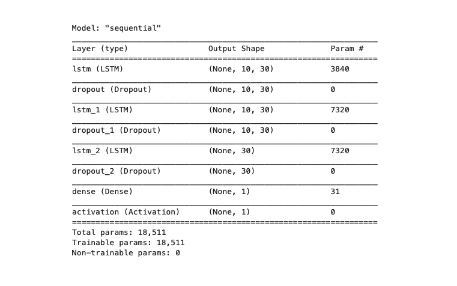
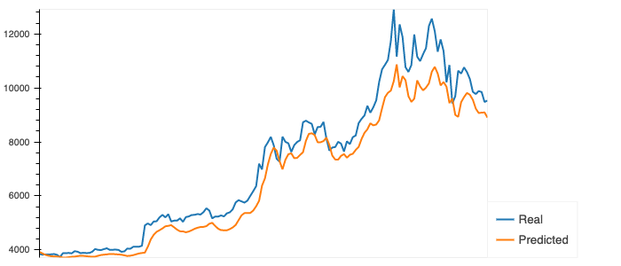
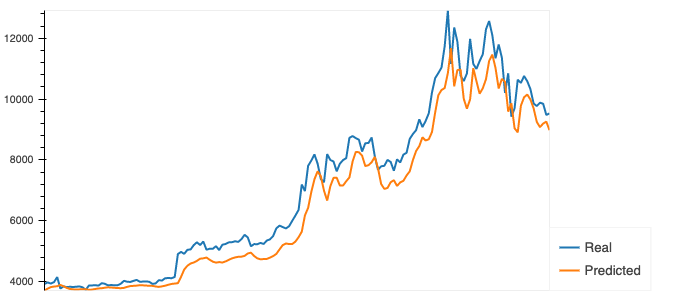
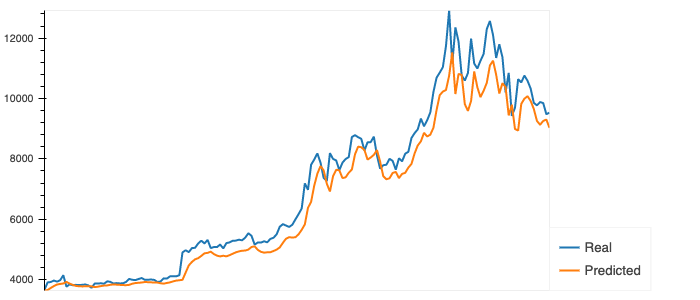
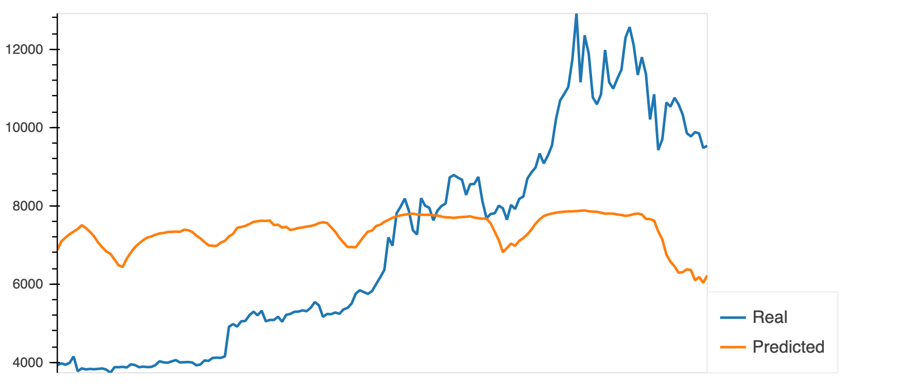

# LSTM Stock Predictor Challenge


## Challenge 

Due to the volatility of cryptocurrency speculation, investors will often try to incorporate sentiment from social media and news articles to help guide their trading strategies. One such indicator is the [Crypto Fear and Greed Index (FNG)](https://alternative.me/crypto/fear-and-greed-index/) which attempts to use a variety of data sources to produce a daily FNG value for cryptocurrency. You have been asked to help build and evaluate deep learning models using both the FNG values and simple closing prices to determine if the FNG indicator provides a better signal for cryptocurrencies than the normal closing price data.


- - -

### Files

[Closing Prices Notebook](Starter_Code/lstm_stock_predictor_closing.ipynb)

[FNG Sentiment Notebook](Code/lstm_stock_predictor_fng.ipynb)

- - -
<details close><summary>Requirements</summary>

### Instructions

In this assignment, you will use deep learning recurrent neural networks to model bitcoin closing prices. One model will use the FNG indicators to predict the closing price while the second model will use a window of closing prices to predict the nth closing price.

You will need to:

- [x]  [Prepare the data for training and testing](#prepare-the-data-for-training-and-testing)
- [x]  [Build and train custom LSTM RNNs](#build-and-train-custom-lstm-rnns)
- [x]  [Evaluate the performance of each model](#evaluate-the-performance-of-each-model)

### Prepare the data for training and testing

Use the starter code as a guide to create a Jupyter Notebook for each RNN. The starter code contains a function to help window the data for each dataset.

For the Fear and Greed model, you will use the FNG values to try and predict the closing price. A function is provided in the notebook to help with this.

For the closing price model, you will use previous closing prices to try and predict the next closing price. A function is provided in the notebook to help with this.

Each model will need to use 70% of the data for training and 30% of the data for testing.

Apply a MinMaxScaler to the X and y values to scale the data for the model.

Finally, reshape the X_train and X_test values to fit the model's requirement of (samples, time steps, features).

### Build and train custom LSTM RNNs

In each Jupyter Notebook, create the same custom LSTM RNN architecture. In one notebook, you will fit the data using the FNG values. In the second notebook, you will fit the data using only closing prices.

Use the same parameters and training steps for each model. This is necessary to compare each model accurately.

### Evaluate the performance of each model

Finally, use the testing data to evaluate each model and compare the performance.

Use the above to answer the following:

> Which model has a lower loss?
>
> Which model tracks the actual values better over time?
>
> Which window size works best for the model?


### Submission

* Create Jupyter Notebooks for the homework and host the notebooks on GitHub.

* Include a Markdown that summarizes your homework and include this report in your GitHub repository.

* Submit the link to your GitHub project to Bootcamp Spot.
- - -

### Resources

[Keras Sequential Model Guide](https://keras.io/getting-started/sequential-model-guide/)

[Illustrated Guide to LSTMs](https://towardsdatascience.com/illustrated-guide-to-lstms-and-gru-s-a-step-by-step-explanation-44e9eb85bf21)

[Stanford's RNN Cheatsheet](https://stanford.edu/~shervine/teaching/cs-230/cheatsheet-recurrent-neural-networks)

- - -

Experiment with the model architecture and parameters to see which provides the best results, but be sure to use the same architecture and parameters when comparing each model.

For training, use at least 10 estimators for both models.

- - -

© 2019 Trilogy Education Services, a 2U, Inc. brand. All Rights Reserved.
</details>

----

##  Analysis of Model Performance: 


Having the understanding that predictions for cryptocurriencies such as bitcoin can be misleading. As cryptocurrency lacks major regulation and often investors are ill-informed, and are purchasing based on market speculation or institutional incentives. However, it is nonethless, important to understand it trends and volitility as the crypto market evolves as alternate data metrics.  

For my first model attempt (ever), I created a fairly simple nueral network of: 
- Two LSTM layers, a dense layer and a final acitvation layer. I used a dropout rate of .25. 30 nuerons.
- Training on 100 epochs with a batch size of 4, 
- I experimented with "linear", "sigmoid" and "Tanh", "Elu" activations functions. 
- Measuing loss with "mean squared error", 
- Utilizing the "adam" optimizer,
- "Mae" and "Accuracy" metrics. 

```python
# Build the LSTM model. 
# The return sequences need to be set to True if you are adding additional LSTM layers, but 
# You don't have to do this for the final layer. 
def build_lstm_model(input_data, output_size, number_units=30,
                     activ_func='tanh', dropout_frac=0.25,
                     loss='mse',optimizer='adam', metrics = ["mae", "accuracy"]):
    model = Sequential()    
    model.add(LSTM(number_units, activation=activ_func,return_sequences = True, input_shape=(input_data.shape[1], input_data.shape[2])))
    model.add(Dropout(dropout_frac))
    model.add(LSTM(number_units, return_sequences=True))
    model.add(Dropout(dropout_frac))
    model.add(LSTM(number_units))
    model.add(Dropout(dropout_frac))
    model.add(Dense(units=output_size))
    model.add(Activation(activ_func))    
    model.compile(loss=loss, optimizer=optimizer, metrics = metrics)
    model.summary()
    return model

model = build_lstm_model(X_train, output_size=1)
# Train the model
# Use at least 10 epochs
# Do not shuffle the data
# Experiement with the batch size, but a smaller batch size is recommended    
runModel = model.fit(X_train, y_train, epochs=100, batch_size=4, shuffle=False)
```



- - -
## Closing Price Model Performance
I found that "Tanh" provided me with the lowest MAE score in this challenge. However, the Accuracy score remained the same of .27 in every model. Increasing only to an accuracy of .28 when I attempted the "elu" activation however saw increased MAE and loss. 

### 30 day Window:


#### Train: 
    Epoch 100/100
    357/357 [==============================] - 8s 22ms/sample - 
    loss: 0.0019 - mae: 0.0308 - accuracy: 0.0028

#### Evaluate:

    ===================================] - 3s 17ms/sample - 
    loss: 0.0109 - mae: 0.0623 - accuracy: 0.0065
    6.23% (+/- 0.00%)


### 10 day Window - 

#### Train:

    Epoch 100/100
    371/371 [==============================] - 3s 9ms/sample - 
    loss: 0.0021 - mae: 0.0338 - accuracy: 0.0027
#### Evaluate: 

    ===================================================] - 2s 14ms/sample - 
    loss: 0.0075 - mae: 0.0580 - accuracy: 0.0063
    5.80% (+/- 0.00%)


### 5 Day Window:



#### Train:
    Epoch 100/100
    374/374 [==============================] - 2s 5ms/sample - loss: 0.0022 - mae: 0.0341 - accuracy: 0.0027

#### Evaluate: 
    =======================================] - 2s 13ms/sample - loss: 0.0031 - mae: 0.0500 - accuracy: 0.0062   
    5.00% (+/- 0.00%)

- - -
## FNG Model Performance

The FNG model compares fear and greed sentiment. Here we are not getting a proper model to predict from. However, this makes sense. Due to the lack of regulation, true knowledge and understanding of the crypto market. The data leans heavely towards fear and greed in the market even as the price exceeds the predicted values fairly consistently. The correlation does not give us the oppurutnity to predict price using this sentiment. 


- - -
<details close><summary>Notes On Testing</summary>

### Testing: 
- Also attempted to smooth with Savgol_Filter() however, saw higher loss, may be coding error. 

Linear Vs Tanh: 
-  "tanh" as main activator batch 4 epoch 100 
producing "5.38%" 
- 2s 13ms/sample - loss: 0.0088 - mae: 0.0538 - accuracy: 0.0063
- Epoch 50/50
    368/368 [==============================] - 4s 10ms/sample - loss: 0.0026 - mae:   0.0370 - accuracy: 0.0027
- Using "linear" produced a MAE score of 6.4% 


- We can see that the loss and mae are steadily decreasing as well. 


 
Tanh with Savgol_filter:
- loss: 0.0102 - mae: 0.0578 - accuracy: 0.0000e+00
5.78% (+/- 0.00%)

Linear With Savgol_filter:
- 368/368 [==============================] - 3s 9ms/sample - loss: 0.0038 - mae: 0.0432 - accuracy: 0.0000e+00

- 1s 7ms/sample - loss: 0.0138 - mae: 0.0687 - accuracy: 0.0000e+00


- 6.87% (+/- 0.00%)

Sigmoid:
- produces MAE of 25%  - in the model the mae and loss are very high 
 
 Relu: 
 - producuces MAE of 13% in evaluation- in the model.fit the loss is to .005 and mae to 0.056
 
- Window period of 10 vs 7 

Elu:
- 0.0084 - mae: 0.0567 - accuracy: 0.0063
['loss', 'mae', 'accuracy']
5.67% (+/- 0.00%)
</details>

